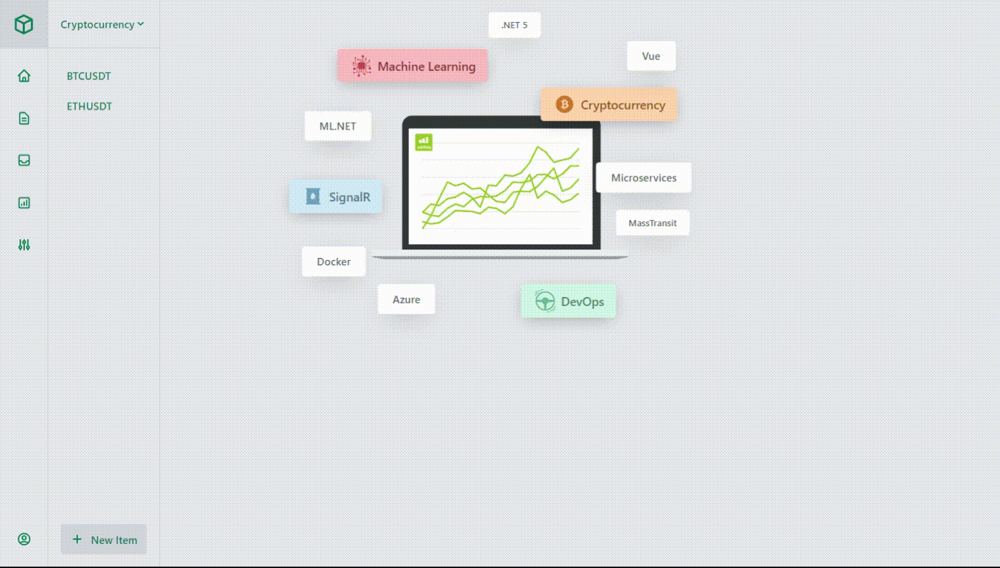

# CryptoPredictor

## A simple application to cover :
- Microservice architecture 
- SignalR real time messaging 
- RabbitMQ service bus
- Secured microservices 
- Machine learning 
- Nice front end 

## Lessons learned
- .NET 5 helps you to develop microservices easily.
- Binance and many other cryptocurrencies broker provide public API to get data feeds.
- Masstransit is break through into microservices for .NET developers.
- ML.NET support building many machine learning applications with less code.
- Vue.js framework helps you to build complete front end application with less code than other frameworks.
- SignalR binds both client and server together and allow remote method invocation to both.
